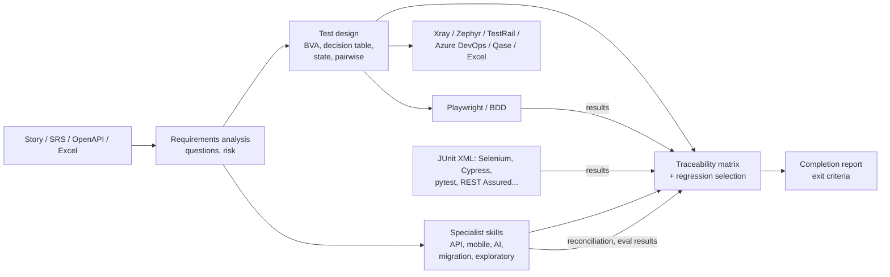

# QA Suite: professional software-testing skills for AI agents

[](LICENSE)   

**[Türkçe README →](README.md)**


QA Suite is a package of 17 Agent Skills that teaches your AI assistant to **work like a senior test analyst**. It runs on Claude Code, claude.ai, the Claude API, and any tool that supports the open Agent Skills standard. It covers:

1. requirements analysis
2. test design with ISTQB techniques
3. traceability
4. export to Xray, Zephyr, TestRail, Azure DevOps, Qase or Excel
5. Playwright and BDD automation
6. API contract and authorisation testing from OpenAPI
7. exploratory sessions (SBTM), mobile apps, AI/LLM features and data migrations
8. synthetic test data and masking
9. performance, accessibility and security testing
10. risk-based regression selection, defect and completion reporting

Output is in Turkish or English.

## Why it is different
- **It computes the combinatorics instead of guessing them.** Deterministic Python scripts calculate the boundary values, decision tables, state transitions and pairwise sets. The gaps and conflicts they find come back as clarification questions.
- **One ID chain.** Everything stays linked through a single chain of IDs:
  `REQ-001` → design evidence → `TC-001` → a Playwright test tagged `@TC-001` → its result → the traceability matrix → Jira/Xray.
- **Honest by design.** An unimplemented test never counts as passed. Missing data is reported as "unknown", not as zero. An expected result is never bent to match buggy behaviour.

## Start in 10 minutes
[examples/quickstart](examples/quickstart/README.en.md) has a small, synthetic password-reset story with 6 acceptance criteria. You copy and paste one prompt. In light mode, in about 10 minutes, you get:
- a requirements list and the questions for the product owner;
- boundary-value, decision-table and state-transition evidence computed by scripts;
- 25 test cases and a traceability matrix;
- an Excel file.

All the expected outputs are in the folder, so you can compare your own run with them. The story and outputs are in Turkish; an English prompt gives English artifacts.

If you run tests by hand, read the **[manual tester guide](docs/MANUEL-TEST-REHBERI.md)** (in Turkish). It covers the 5 skills you need, 6 ready-made prompt cards, how to anonymise a real story before sharing it, cost expectations and how to open the outputs in Excel.

## Evidence: blind trials with planted defects
In each trial the agent got only what a tester would get (a story, an OpenAPI document or data extracts), never the code or the answer key.

| Trial | Planted defects | Also found | Verdict |
|---|---|---|---|
| FAST money transfer, web app, end to end | **5/5** | 1 real unplanted defect; every ambiguity raised as a question | "Not ready": correct |
| Demo Bank API (OpenAPI) | **5/5**, including BOLA | 2 real unplanted defects; 17 contract questions | An independent rerun gave the same result: 31 passed / 11 failed |
| Customer data migration (cp1254 → UTF-8) | **9/9** | No false positives on the Turkish-casing and format traps | No-go: correct |

Proxy routing across all 17 skills: **84/84** requests routed correctly, including 5 near-misses that need no skill. There are 150 unit tests.

Methodology, costs and what was *not* measured: **[docs/EVALUATION.en.md](docs/EVALUATION.en.md)**. The real outputs of each trial are in [examples/](examples/). They are in Turkish.

## Skills
| Skill | What it does |
|---|---|
| `qa-orchestrator` | Runs the end-to-end flow, its stages and its gates |
| `planning-tests` | Writes an ISO 29119-3 test plan with measurable exit criteria and an effort range |
| `analyzing-requirements` | ISO 29148 quality review, TR/EN ambiguity linter, missing requirements and NFR discovery (ISO 25010), risk scoring, question log |
| `designing-test-cases` | EP/BVA, decision table, state transition and pairwise scripts; risk-based test cases; TCKN/IBAN test data checks |
| `testing-nonfunctional` | k6 load tests with thresholds taken from the requirements; WCAG 2.2 A/AA (55 criteria); OWASP ASVS 5.0 |
| `tracing-requirements` | Traceability matrix, coverage gaps, checks for priority inflation and redundant tests, change impact, **risk-based regression selection** within a time budget |
| `exporting-test-cases` | Export to Xray, Zephyr Scale, TestRail, Azure DevOps Test Plans, Qase, Excel, CSV and Markdown |
| `automating-with-playwright` | Project scaffold and `@TC`-tagged specs; feeds the results back into the traceability matrix |
| `writing-bdd-scenarios` | Gherkin in TR/EN, run through playwright-bdd |
| `reporting-test-results` | Defect reports, and a completion report that evaluates the exit criteria automatically |
| `reviewing-test-cases` | Imports Excel or TestRail CSV exports and audits the tests' quality |
| `testing-apis` | OpenAPI 3 → contract tests and an executable Playwright API suite with the same TC IDs: schema checks, boundaries, BOLA, contract-gap questions, request/response evidence |
| `running-exploratory-tests` **(experimental)** | Session-based exploratory testing: risk-ranked charters, heuristics (SFDIPOT, FEW HICCUPPS, tours), session sheets → summary, defects and regression tests |
| `testing-ai-features` **(experimental)** | LLM, chatbot and RAG testing: an adversarial eval set (OWASP LLM Top 10 2025, TR/EN), deterministic scoring over repeated runs, flakiness and a release gate |
| `preparing-test-data` **(experimental)** | Synthetic data with valid TCKN/VKN/IBAN and referential integrity; deterministic masking of production extracts (KVKK/GDPR) |
| `testing-mobile-apps` **(experimental)** | iOS/Android checklists (lifecycle, interruptions, permissions, offline, MASVS, accessibility), a device matrix from usage share, JUnit → results |
| `testing-data-migrations` | Source–target reconciliation (keys, fields, control totals, Turkish encoding traps), SQL templates, sign-off criteria |

**Experimental:** these four skills have no blind trial yet. They are covered by unit tests and script demos; their blind trials are running for 0.7.

There are also **domain packs** for fintech/banking, e-commerce, health, the public sector, insurance/pensions and telecom. Each contains a regulations checklist, the requirements people often forget, high-risk rules, and synthetic test data.

## Install
**Claude Code (recommended):**
```bash
claude plugin marketplace add alinurettin/testskills
claude plugin install qa-suite@qa-suite-marketplace
```

**claude.ai / Claude API:** download the skill zips from [Releases](https://github.com/alinurettin/testskills/releases) and upload them under **Settings → Skills**. The skills hand work to each other, so upload all 17.

**Other agents (Codex, Copilot, Cursor, Gemini CLI…):** the package follows the open Agent Skills standard. Copy the folders under `skills/` into your tool's skills directory.

**Requirements:**
- Python 3.9+ (the scripts use only the standard library)
- For automation: Node.js 22, 24 or 26 (the versions Playwright supports) and `@playwright/test`

## Quick start
```
Run a full test analysis for this user story and prepare an Xray import CSV: <story>
Design boundary-value and decision-table tests for the loan application form.
Automate the smoke tests in qa/test-cases.json with Playwright and link the results to the RTM.
Review our team's Excel test cases and find the weak and missing ones.
Prepare the sprint test completion report: are the exit criteria met?
Test this API from its OpenAPI spec, including whether users can read each other's data.
REQ-004 changed and we have 2 hours: which regression tests do we run?
Reconcile the legacy and new customer extracts and tell me whether we can sign off the migration.
Build an eval set for our support chatbot: prompt injection, hallucination, PII leakage.
```
Outputs go to `qa/` in your project: requirements, questions, design evidence, test cases, the traceability matrix, export files and reports. Automation goes to `automation/`.

## How it works


## Standards
- **Test design:** ISTQB CTFL v4.0 and CTAL-TA v4.0, ISO/IEC/IEEE 29119-3/-4
- **Requirements and quality:** ISO/IEC/IEEE 29148, EARS, INVEST, ISO/IEC 25010:2023
- **Accessibility and security:** WCAG 2.2 AA, OWASP ASVS 5.0, OWASP Top 10:2025

No standard text is reproduced; the content is paraphrased into actionable checklists.

## Privacy: what leaves your machine
- **The scripts run on your machine and make no network calls.** They use only the Python standard library. Nothing under `skills/*/scripts` uses `urllib`, `http`, `socket` or `requests` (checked by searching the source). They read your files and write their results to `qa/`.
- **Everything you give the assistant goes to the model provider.** Your prompts, the contents of files the assistant reads, and screenshots are processed under your plan's terms, which govern retention and training use. Check your organisation's rules and your plan's data terms.
- **Use synthetic or anonymised data.** Do not paste real customer data, production extracts, internal system addresses or confidential business rules. Section 3 of the [manual tester guide](docs/MANUEL-TEST-REHBERI.md) (in Turkish) shows how to anonymise a story. If masking is really needed, run `mask_data.py` from `preparing-test-data` yourself, locally, and give the assistant only the masked output.
- **The tests you run go to the system you point them at.** Playwright and k6 tests send requests to the application at the address you give. `npm install` and the browser install download packages; the skill instructions tell the assistant to ask for your approval first.
- **The demo trial servers are local.** The servers under `evals/` run on your machine with Node's built-in modules and make no outbound requests. Some of them listen on all network interfaces, so run them on a trusted network.

## Known limits
- **Not yet tested against real tools:** the Xray, Zephyr, TestRail, Azure DevOps and Qase imports and the Xray results reporter follow the official documentation but have not been run against a live server. Do a 2–3 test trial import first.
- **k6:** the scripts are generated and syntax-checked, but no real load run has been done.
- **Triggering:** skill routing has only been measured with a proxy method (84/84), not with Claude Code's real trigger mechanism.
- **No blind trial yet** for the exploratory, AI, mobile and test-data skills: they are covered by unit tests and script demos.
- **Windows console:** if Turkish help text looks garbled in PowerShell, set `$env:PYTHONIOENCODING='utf-8'` (the files themselves are always UTF-8).
- **Domain packs** are checklists, not legal advice. Confirm the current regulations with your compliance team.

## Development
```bash
python tools/sync_shared.py && python tools/validate_skills.py && python -m unittest discover -s tests
python tools/package_skills.py       # zips for claude.ai (dist/)
python tools/routing_proxy.py build evals/trigger-queries*.json --out prompt.txt   # proxy routing eval
```
Issues and pull requests are welcome. [CONTRIBUTING.md](CONTRIBUTING.md) explains how to run the checks, how to propose a skill, and the issue templates. To run a blind trial yourself, see [evals/README.md](evals/README.md). See [CHANGELOG.md](CHANGELOG.md) for the history.

## License
[MIT](LICENSE) © 2026 Ali Nurettin Demir
