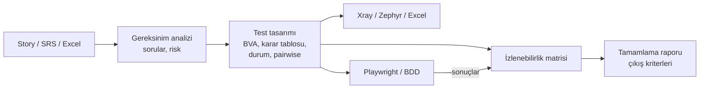

# QA Suite: Yapay zekâ için profesyonel yazılım test skill'leri

[](LICENSE)   

**[English README →](README.en.md)**


Yapay zekâ asistanınıza (Claude Code, claude.ai, Claude API ve Agent Skills standardını destekleyen diğer araçlar) **kıdemli bir test analisti gibi çalışmayı** öğreten 11 skill'lik bir paket. Kapsadığı akış:

1. gereksinim analizi
2. ISTQB tekniklerine dayalı test tasarımı
3. izlenebilirlik
4. Xray/Zephyr/Excel'e aktarım
5. Playwright ve BDD otomasyonu
6. performans, erişilebilirlik ve güvenlik testleri
7. hata ve tamamlama raporları

Türkçe ve İngilizce çıktı üretir.

## Neden farklı?
- **Kombinasyonları tahmin ettirmez, hesaplatır.** Sınır değerler, karar tabloları, durum geçişleri ve pairwise setleri deterministik Python script'leriyle hesaplanır. Script'lerin bulduğu boşluk ve çelişkiler netleştirme sorusu olarak geri döner.
- **Tek ID zinciri.** Her şey tek bir kimlik zinciriyle birbirine bağlı kalır:
  `REQ-001` → tasarım kanıtı → `TC-001` → `@TC-001` etiketli Playwright testi → koşum sonucu → izlenebilirlik matrisi → Jira/Xray.
- **Dürüst raporlama.** Uygulanmamış bir test asla "geçti" sayılmaz. Eksik veri "0" değil "bilinmiyor" olarak raporlanır. Beklenen sonuç, testi geçirmek için asla hatalı davranışa uydurulmaz.

## Kanıt: kör uçtan uca deneme
Yeni bir bankacılık senaryosu hazırlandı: FAST para transferi. Kullanılan demo uygulamaya, ajana söylenmeden **5 hata** yerleştirildi.

| | Sonuç |
|---|---|
| Yerleştirilen hatalar | **5/5 bulundu**, artı yerleştirilmemiş gerçek bir hata |
| Story'deki belirsizlikler ("hızlı", "uygun mesaj", "belirlenecek") | Hepsi soru olarak raporlandı |
| Test tasarımı | 47 test; öncelik dağılımı %2 kritik, %34 yüksek |
| Playwright | 46/46 aday otomatize edildi, sonuç 37 geçti / 9 kaldı. Bağımsız yeniden koşum aynı sonucu verdi. |
| Yayın kararı | "Hazır değil" (9 çıkış kriterinden 4'ü karşılandı), doğru karar |

Tüm gerçek çıktılar: **[examples/fast-transfer](examples/fast-transfer/README.md)**

## Skill'ler
| Skill | Ne yapar |
|---|---|
| `qa-orchestrator` | Uçtan uca akışı, aşamaları ve kapıları yönetir |
| `planning-tests` | ISO 29119-3 test planı yazar; ölçülebilir çıkış kriterleri ve efor aralığı içerir |
| `analyzing-requirements` | ISO 29148 kalite incelemesi, TR/EN belirsizlik taraması, eksik gereksinim ve NFR keşfi (ISO 25010), risk puanlama ve soru listesi |
| `designing-test-cases` | EP/BVA, karar tablosu, durum geçişi ve pairwise script'leri; risk bazlı test case'ler; TCKN/IBAN test verisi kontrolü |
| `testing-nonfunctional` | Eşikleri gereksinimden gelen k6 yük testi; WCAG 2.2 A/AA (55 kriter); OWASP ASVS 5.0 |
| `tracing-requirements` | İzlenebilirlik matrisi, kapsam boşlukları, öncelik şişmesi ve gereksiz tekrar kontrolleri, değişiklik etkisi |
| `exporting-test-cases` | Xray, Zephyr Scale, Excel, CSV ve Markdown'a aktarım |
| `automating-with-playwright` | Proje iskeleti, `@TC` etiketli spec'ler; sonuçları izlenebilirlik matrisine geri besler |
| `writing-bdd-scenarios` | TR/EN Gherkin; playwright-bdd ile koşum |
| `reporting-test-results` | Hata raporları; çıkış kriterlerini otomatik değerlendiren tamamlama raporu |
| `reviewing-test-cases` | Excel/TestRail CSV içe aktarımı ve test kalitesi denetimi |

Ek olarak **sektör paketleri** var: fintech/bankacılık, e-ticaret, sağlık ve kamu. Her birinde mevzuat kontrol listesi, sık unutulan gereksinimler, yüksek riskli kurallar ve sentetik test verisi bulunur.

## Kurulum
**Claude Code (önerilen):**
```bash
claude plugin marketplace add alinurettin/testskills
claude plugin install qa-suite@qa-suite-marketplace
```

**claude.ai / Claude API:** [Releases](https://github.com/alinurettin/testskills/releases) sayfasından skill zip'lerini indirip **Settings → Skills** bölümünden yükleyin. Skill'ler birbirine görev devrettiği için 11'ini birlikte yüklemeniz önerilir.

**Diğer araçlar (Codex, Copilot, Cursor, Gemini CLI…):** Paket açık Agent Skills standardına uyar. `skills/` altındaki klasörleri aracın skills klasörüne kopyalayın.

**Gereksinimler:**
- Python 3.9+ (script'ler yalnızca standart kütüphaneyi kullanır)
- Otomasyon için Node.js 18+ ve `@playwright/test`

## Hızlı başlangıç
```
Bu user story için baştan sona test analizi yap ve Xray'e aktarılacak CSV'yi hazırla: <story>
Kredi başvuru formu için sınır değer ve karar tablosu testlerini tasarla.
qa/test-cases.json'daki smoke testleri Playwright ile otomatize et, sonuçları RTM'ye bağla.
Ekibin Excel'deki test case'lerini incele, eksik ve hatalı olanları bul.
Sprint sonu test tamamlama raporu hazırla: çıkış kriterleri sağlandı mı?
```
Çıktılar projenizde `qa/` klasörüne yazılır: gereksinimler, sorular, tasarım kanıtları, test case'ler, izlenebilirlik matrisi, export dosyaları ve raporlar. Otomasyon `automation/` klasörüne yazılır.

## Nasıl çalışır


## Standart temeli
- **Test tasarımı:** ISTQB CTFL v4.0 ve CTAL-TA v4.0, ISO/IEC/IEEE 29119-3/-4
- **Gereksinim ve kalite:** ISO/IEC/IEEE 29148, EARS, INVEST, ISO/IEC 25010:2023
- **Erişilebilirlik ve güvenlik:** WCAG 2.2 AA, OWASP ASVS 5.0, OWASP Top 10:2025

Standart metinleri kopyalanmadı; içerikler uygulanabilir kontrol listelerine dönüştürüldü.

## Bilinen sınırlar
- **Gerçek araçlarda denenmedi:** Xray/Zephyr içe aktarımı ve Xray sonuç reporter'ı gerçek bir Jira ortamında denenmedi. Resmi dokümantasyona göre hazırlandı; önce 2–3 testlik deneme importu yapın.
- **k6:** Script'ler üretilip sözdizimi kontrolünden geçirildi, ama gerçek bir yük testi koşturulmadı.
- **Otomatik devreye girme:** Skill'lerin otomatik devreye girmesi yalnızca vekil bir yöntemle ölçüldü (62/62).
- **Sektör paketleri** kontrol listesidir, hukuki tavsiye değildir. Mevzuatın güncel hâlini uyum ekibinizle teyit edin.

## Geliştirme ve katkı
```bash
python tools/sync_shared.py          # shared/ dosyalarını skill'lere dağıtır
python tools/validate_skills.py      # Agent Skills spesifikasyonu ve paket kuralları
python -m unittest discover -s tests # script regresyon testleri
python tools/package_skills.py       # claude.ai için zip'ler (dist/)
```
Issue ve pull request'ler açıktır. Değişiklik geçmişi için: [CHANGELOG.md](CHANGELOG.md).

## Lisans
[MIT](LICENSE) © 2026 Ali Nurettin Demir
