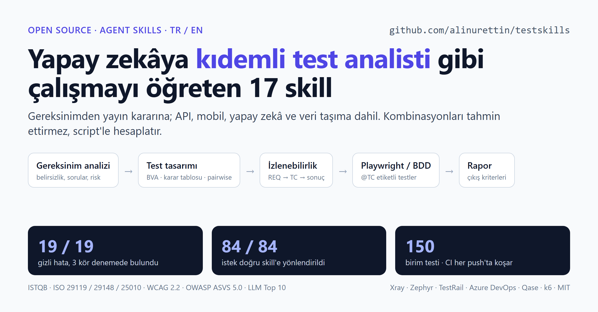
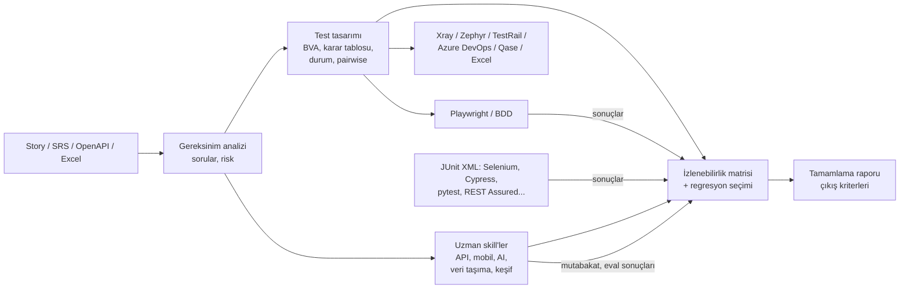

# QA Suite: Yapay zekâ için profesyonel yazılım test skill'leri

[](LICENSE)   

**[English README →](README.en.md)**



Yapay zekâ asistanınıza (Claude Code, claude.ai, Claude API ve Agent Skills standardını destekleyen diğer araçlar) **kıdemli bir test analisti gibi çalışmayı** öğreten 17 skill'lik bir paket. Kapsadığı akış:

1. gereksinim analizi
2. ISTQB tekniklerine dayalı test tasarımı
3. izlenebilirlik
4. Xray, Zephyr, TestRail, Azure DevOps, Qase ve Excel'e aktarım
5. Playwright ve BDD otomasyonu
6. OpenAPI'den API sözleşme ve yetkilendirme testleri
7. keşif testi oturumları (SBTM), mobil uygulamalar, yapay zekâ/LLM özellikleri ve veri taşıma
8. sentetik test verisi ve maskeleme
9. performans, erişilebilirlik ve güvenlik testleri
10. risk bazlı regresyon seçimi, hata ve tamamlama raporları

Türkçe ve İngilizce çıktı üretir.

## Neden farklı?
- **Kombinasyonları tahmin ettirmez, hesaplatır.** Sınır değerler, karar tabloları, durum geçişleri ve pairwise setleri deterministik Python script'leriyle hesaplanır. Script'lerin bulduğu boşluk ve çelişkiler netleştirme sorusu olarak geri döner.
- **Tek ID zinciri.** Her şey tek bir kimlik zinciriyle birbirine bağlı kalır:
  `REQ-001` → tasarım kanıtı → `TC-001` → `@TC-001` etiketli Playwright testi → koşum sonucu → izlenebilirlik matrisi → Jira/Xray.
- **Dürüst raporlama.** Uygulanmamış bir test asla "geçti" sayılmaz. Eksik veri "0" değil "bilinmiyor" olarak raporlanır. Beklenen sonuç, testi geçirmek için asla hatalı davranışa uydurulmaz.

## 10 dakikada başla
[examples/quickstart](examples/quickstart/README.md) klasöründe 6 kabul kriterli, sentetik bir şifre sıfırlama story'si var. Tek bir istemi kopyalayıp yapıştırırsınız. Hafif modda yaklaşık 10 dakikada şunları alırsınız:
- gereksinim listesi ve ürün sahibine gidecek sorular;
- script'le hesaplanmış sınır değer, karar tablosu ve durum geçişi kanıtı;
- 25 test case ve izlenebilirlik matrisi;
- bir Excel dosyası.

Beklenen çıktıların tamamı klasörde duruyor; kendi sonucunuzu onlarla karşılaştırabilirsiniz.

Testleri elle koşuyorsanız: **[Manuel test rehberi](docs/MANUEL-TEST-REHBERI.md)**. Hangi 5 skill'e ihtiyacınız olduğunu anlatır; 6 hazır istem kartı, gerçek bir story'yi paylaşmadan önce anonimleştirme, maliyet beklentisi ve çıktıları Excel'de açma adımları içerir.

## Kanıt: hata yerleştirilmiş kör denemeler
Her denemede ajana yalnızca bir test uzmanına verilecek girdiler verildi: bir story, bir OpenAPI dokümanı ya da veri extract'ları. Uygulama kodu ve cevap anahtarı hiçbir zaman gösterilmedi.

| Deneme | Yerleştirilen hatalar | Ayrıca bulunan | Karar |
|---|---|---|---|
| FAST para transferi, web uygulaması, uçtan uca | **5/5** | Yerleştirilmemiş 1 gerçek hata; tüm belirsizlikler soru olarak raporlandı | "Hazır değil": doğru |
| Demo Bank API (OpenAPI) | BOLA dahil **5/5** | Yerleştirilmemiş 2 gerçek hata; 17 sözleşme sorusu | Bağımsız yeniden koşum aynı sonucu verdi: 31 geçti / 11 kaldı |
| Müşteri verisi taşıma (cp1254 → UTF-8) | **9/9** | Türkçe büyük harf ve format tuzaklarında yanlış alarm yok | "Go değil": doğru |

17 skill'in tamamında vekil yönlendirme ölçümü: **84/84** istek doğru skill'e gitti. Bunlara skill gerektirmeyen 5 yakın istek de dahil. Ayrıca 150 birim testi var.

Yöntem, maliyetler ve neyin *ölçülmediği*: **[docs/EVALUATION.md](docs/EVALUATION.md)**. Her denemenin gerçek çıktıları: [examples/](examples/).

## Skill'ler
| Skill | Ne yapar |
|---|---|
| `qa-orchestrator` | Uçtan uca akışı, aşamaları ve kapıları yönetir |
| `planning-tests` | ISO 29119-3 test planı yazar; ölçülebilir çıkış kriterleri ve efor aralığı içerir |
| `analyzing-requirements` | ISO 29148 kalite incelemesi, TR/EN belirsizlik taraması, eksik gereksinim ve NFR keşfi (ISO 25010), risk puanlama ve soru listesi |
| `designing-test-cases` | EP/BVA, karar tablosu, durum geçişi ve pairwise script'leri; risk bazlı test case'ler; TCKN/IBAN test verisi kontrolü |
| `testing-nonfunctional` | Eşikleri gereksinimden gelen k6 yük testi; WCAG 2.2 A/AA (55 kriter); OWASP ASVS 5.0 |
| `tracing-requirements` | İzlenebilirlik matrisi, kapsam boşlukları, öncelik şişmesi ve gereksiz tekrar kontrolleri, değişiklik etkisi, zaman bütçeli **risk bazlı regresyon seçimi** |
| `exporting-test-cases` | Xray, Zephyr Scale, TestRail, Azure DevOps Test Plans, Qase, Excel, CSV ve Markdown'a aktarım |
| `automating-with-playwright` | Proje iskeleti, `@TC` etiketli spec'ler; sonuçları izlenebilirlik matrisine geri besler |
| `writing-bdd-scenarios` | TR/EN Gherkin; playwright-bdd ile koşum |
| `reporting-test-results` | Hata raporları; çıkış kriterlerini otomatik değerlendiren tamamlama raporu |
| `reviewing-test-cases` | Excel/TestRail CSV içe aktarımı ve test kalitesi denetimi |
| `testing-apis` | OpenAPI 3'ten sözleşme testleri ve aynı TC ID'leriyle koşturulabilir Playwright API paketi: şema kontrolü, sınırlar, BOLA, sözleşme boşluğu soruları, istek/yanıt kanıtı |
| `running-exploratory-tests` **(deneysel)** | Oturum bazlı keşif testi: riske göre sıralı görev kartları (charter), sezgisel yöntemler (SFDIPOT, FEW HICCUPPS, turlar), oturum notlarından özet, hata ve regresyon testi |
| `testing-ai-features` **(deneysel)** | LLM, chatbot ve RAG testi: saldırgan eval seti (OWASP LLM Top 10 2025, TR/EN), tekrarlı koşularda deterministik puanlama, kararsızlık ve yayın kapısı |
| `preparing-test-data` **(deneysel)** | Geçerli TCKN/VKN/IBAN'lı, ilişkisel bütünlüklü sentetik veri; üretim extract'larının deterministik maskelenmesi (KVKK/GDPR) |
| `testing-mobile-apps` **(deneysel)** | iOS/Android kontrol listeleri (yaşam döngüsü, kesintiler, izinler, çevrimdışı, MASVS, erişilebilirlik), kullanım payından cihaz matrisi, JUnit → sonuçlar |
| `testing-data-migrations` | Kaynak–hedef mutabakatı (anahtarlar, alanlar, kontrol toplamları, Türkçe karakter kodlama tuzakları), SQL şablonları, imza kriterleri |

**Deneysel:** Bu dört skill'in henüz kör denemesi yok. Birim testleri ve script demolarıyla doğrulandılar; 0.7 için kör denemeleri sürüyor.

Ek olarak **sektör paketleri** var: fintech/bankacılık, e-ticaret, sağlık, kamu, sigorta/emeklilik ve telekom. Her birinde mevzuat kontrol listesi, sık unutulan gereksinimler, yüksek riskli kurallar ve sentetik test verisi bulunur.

## Kurulum
**Claude Code (önerilen):**
```bash
claude plugin marketplace add alinurettin/testskills
claude plugin install qa-suite@qa-suite-marketplace
```

**claude.ai / Claude API:** [Releases](https://github.com/alinurettin/testskills/releases) sayfasından skill zip'lerini indirip **Settings → Skills** bölümünden yükleyin. Skill'ler birbirine görev devrettiği için 17'sini birlikte yüklemeniz önerilir.

**Diğer araçlar (Codex, Copilot, Cursor, Gemini CLI…):** Paket açık Agent Skills standardına uyar. `skills/` altındaki klasörleri aracın skills klasörüne kopyalayın.

**Gereksinimler:**
- Python 3.9+ (script'ler yalnızca standart kütüphaneyi kullanır)
- Otomasyon için Node.js 22, 24 veya 26 (Playwright'ın desteklediği sürümler) ve `@playwright/test`

## Hızlı başlangıç
```
Bu user story için baştan sona test analizi yap ve Xray'e aktarılacak CSV'yi hazırla: <story>
Kredi başvuru formu için sınır değer ve karar tablosu testlerini tasarla.
qa/test-cases.json'daki smoke testleri Playwright ile otomatize et, sonuçları RTM'ye bağla.
Ekibin Excel'deki test case'lerini incele, eksik ve hatalı olanları bul.
Sprint sonu test tamamlama raporu hazırla: çıkış kriterleri sağlandı mı?
Bu API'yi OpenAPI dokümanından test et; kullanıcılar birbirinin verisine erişebiliyor mu?
REQ-004 değişti, 2 saatimiz var: hangi regresyon testlerini koşalım?
Eski ve yeni sistemin müşteri extract'larını karşılaştır, taşımayı imzalayabilir miyiz?
Destek chatbot'umuz için eval seti hazırla: prompt injection, halüsinasyon, kişisel veri sızıntısı.
```
Çıktılar projenizde `qa/` klasörüne yazılır: gereksinimler, sorular, tasarım kanıtları, test case'ler, izlenebilirlik matrisi, export dosyaları ve raporlar. Otomasyon `automation/` klasörüne yazılır.

## Nasıl çalışır


## Standart temeli
- **Test tasarımı:** ISTQB CTFL v4.0 ve CTAL-TA v4.0, ISO/IEC/IEEE 29119-3/-4
- **Gereksinim ve kalite:** ISO/IEC/IEEE 29148, EARS, INVEST, ISO/IEC 25010:2023
- **Erişilebilirlik ve güvenlik:** WCAG 2.2 AA, OWASP ASVS 5.0, OWASP Top 10:2025

Standart metinleri kopyalanmadı; içerikler uygulanabilir kontrol listelerine dönüştürüldü.

## Veri gizliliği: makinenizden ne çıkar?
- **Script'ler makinenizde çalışır ve ağa bağlanmaz.** Hepsi yalnızca Python standart kütüphanesini kullanır. `skills/*/scripts` altında `urllib`, `http`, `socket` ya da `requests` kullanımı yoktur (kaynak kodda aranarak kontrol edildi). Dosyalarınızı okur ve sonuçları `qa/` altına yazarlar.
- **Asistana verdiğiniz her şey model sağlayıcısına gider.** Yazdığınız istemler, asistanın okuduğu dosyaların içeriği ve ekran görüntüleri, kullandığınız planın koşullarına göre işlenir; saklama ve eğitimde kullanım bu koşullara bağlıdır. Kurumunuzun kuralını ve planınızın veri koşullarını kontrol edin.
- **Sentetik ya da anonimleştirilmiş veri kullanın.** Gerçek müşteri verisini, üretim extract'larını, iç sistem adreslerini ve gizli iş kurallarını yapıştırmayın. Nasıl anonimleştirileceği [Manuel test rehberi](docs/MANUEL-TEST-REHBERI.md)'nin 3. bölümünde anlatılıyor. Maskeleme gerçekten gerekiyorsa `preparing-test-data`'nın `mask_data.py` script'ini kendiniz, yerelde çalıştırın ve asistana yalnızca maskeli çıktıyı verin.
- **Koşturduğunuz testler sizin gösterdiğiniz sisteme gider.** Playwright ve k6 testleri, verdiğiniz adresteki uygulamaya istek atar. `npm install` ve tarayıcı kurulumu paket indirir; skill talimatları, asistanın bundan önce onayınızı almasını ister.
- **Demo deneme sunucuları yereldir.** `evals/` altındaki sunucular Node'un yerleşik modülleriyle makinenizde çalışır ve dışarıya istek atmaz. Bir kısmı tüm ağ arayüzlerini dinler; bu yüzden güvenilir bir ağda çalıştırın.

## Bilinen sınırlar
- **Gerçek araçlarda denenmedi:** Xray, Zephyr, TestRail, Azure DevOps ve Qase içe aktarımları ile Xray sonuç reporter'ı gerçek bir sunucuda denenmedi. Resmi dokümantasyona göre hazırlandı; önce 2–3 testlik deneme importu yapın.
- **k6:** Script'ler üretilip sözdizimi kontrolünden geçirildi, ama gerçek bir yük testi koşturulmadı.
- **Otomatik devreye girme:** Skill yönlendirmesi yalnızca vekil bir yöntemle ölçüldü (84/84). Claude Code'un gerçek tetiklenme mekanizmasıyla ölçülmedi.
- **Kör denemesi olmayanlar:** Keşif testi, yapay zekâ, mobil ve test verisi skill'leri için henüz kör deneme yapılmadı. Bunlar birim testleri ve script demolarıyla doğrulandı.
- **Windows konsolu:** PowerShell'de Türkçe yardım metni bozuk görünüyorsa `$env:PYTHONIOENCODING='utf-8'` ayarlayın. Dosyaların kendisi her zaman UTF-8'dir.
- **Sektör paketleri** kontrol listesidir, hukuki tavsiye değildir. Mevzuatın güncel hâlini uyum ekibinizle teyit edin.

## Geliştirme ve katkı
```bash
python tools/sync_shared.py          # shared/ dosyalarını skill'lere dağıtır
python tools/validate_skills.py      # Agent Skills spesifikasyonu ve paket kuralları
python tools/routing_proxy.py build evals/trigger-queries*.json --out prompt.txt   # vekil yönlendirme ölçümü
python -m unittest discover -s tests # script regresyon testleri
python tools/package_skills.py       # claude.ai için zip'ler (dist/)
```
Issue ve pull request'ler açıktır. Kontrollerin nasıl koşturulacağı, yeni skill önerisi ve issue şablonları için: [CONTRIBUTING.md](CONTRIBUTING.md). Kör denemeyi kendiniz koşmak için: [evals/README.md](evals/README.md). Değişiklik geçmişi için: [CHANGELOG.md](CHANGELOG.md).

## Lisans
[MIT](LICENSE) © 2026 Ali Nurettin Demir
